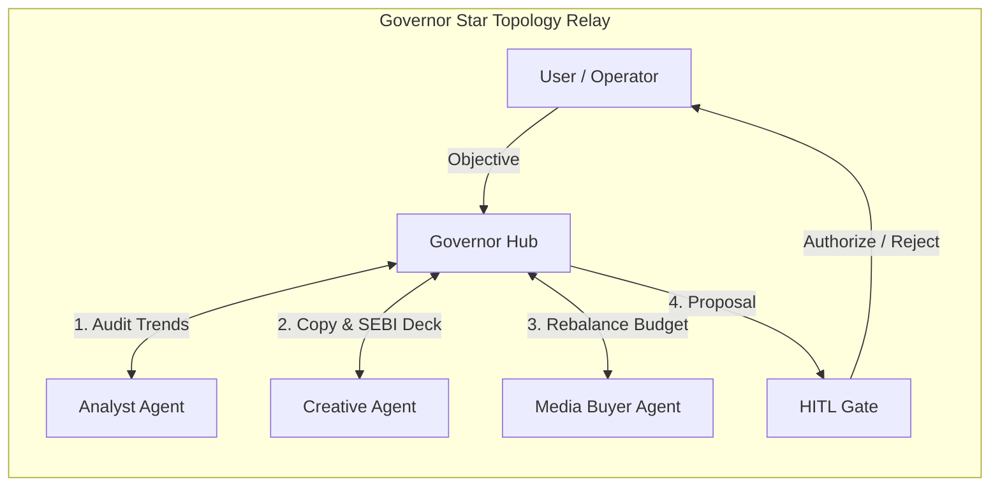

# HELM: High-Governance Enterprise Language Model Platform
## Developer Architecture & Operations Guide

> **System Version:** 1.0.0  
> **Topology:** Central Governor Star Relay (`AN` ↔ `GV` ↔ `CR` ↔ `GV` ↔ `MB` ↔ `GV` ↔ `HITL`)  
> **Target Runtime:** Python 3.11+ / FastAPI / LangGraph / Next.js 14 (App Router) / SQLite Checkpointing

---

## 1. Executive Summary & Core Philosophy

**HELM** is an enterprise multi-agent operations platform built for regulated financial services environments (SEBI/SEC compliance). It orchestrates specialized autonomous agents under strict policy constraints, budget caps, and human-in-the-loop (HITL) gates.

### Core Architectural Invariants
1. **Star Topology Relay**: Specialist agents (`Analyst`, `Creative`, `Media Buyer`) **never communicate directly** with one another. All inter-agent data flow is routed through the **Governor**, which validates, enriches, sanitizes against prompt injection, and audits every handoff envelope.
2. **Deterministic Policy in Code**: Compliance rules (e.g., zero promised returns, mandatory risk disclosure) and financial constraints (e.g., maximum $\pm25\%$ daily budget shift per campaign, zero net budget inflation) are strictly evaluated in **deterministic Python/TypeScript code**, never delegated to LLM prompt compliance.
3. **Strict Credential Isolation**: Workers **never** hold model provider API keys (`OPENAI_API_KEY`, `ANTHROPIC_API_KEY`, `GEMINI_API_KEY`) or production database URLs. All model calls route through the Control Plane Gateway (`api/`), which reserves budget, reconciles actual token usage, and logs audit events.
4. **Durable Interrupt Checkpointing**: Multi-agent graphs compile with asynchronous SQLite persistence (`AsyncSqliteSaver`). When a run pauses at the HITL gate, process memory is released. Resuming from disk never repeats earlier model calls.



---

## 2. Directory Layout & Subsystem Responsibilities

```
HELM/
├── api/                     # FastAPI Control Plane & Model Gateway
│   ├── app/
│   │   ├── api/             # REST Endpoints (v1: agents, workspace, completions)
│   │   ├── gateway/         # Model Gateway, Rate-Card Ledger, Token Metering
│   │   ├── db/              # Repositories & Database Schemas (SQLite / Postgres)
│   │   └── core/            # Config, Security, Auth, Logging
│   └── tests/               # Control plane integration & unit tests
│
├── workers/                 # Durable Agent Worker Runtime (LangGraph)
│   ├── helm_worker/
│   │   ├── agents/          # Specialist agent graphs (Governor, Analyst, Creative, MB)
│   │   │   ├── governor/    # Star relay graph, state definitions, orchestration
│   │   │   ├── analyst/     # Read-only research & grounded citation extraction
│   │   │   ├── creative/    # Copy production & deterministic SEBI rule checks
│   │   │   └── media_buyer/ # Budget optimizer & +/-25% cap policy engine
│   │   ├── checkpoint.py    # Async SQLite checkpointer for LangGraph
│   │   ├── envelope.py      # Typed Handoff Envelope schema definitions
│   │   ├── gateway_client.py# Worker HTTP client for control plane gateway
│   │   ├── sanitizer.py     # Prompt-injection data block framing
│   │   └── __main__.py      # Unified CLI entrypoint
│   └── tests/               # End-to-end agent workflow tests
│
├── web/                     # Next.js 14 Web Application & Interactive UI
│   ├── app/
│   │   ├── (app)/
│   │   │   ├── agents/      # Interactive Operations Console (Live Star Relay)
│   │   │   ├── approvals/   # Human-in-the-Loop Decision Inbox
│   │   │   ├── studio/      # Creative variant studio & visual deck inspection
│   │   │   ├── workspace/   # Grounded RAG conversational workspace
│   │   │   ├── campaigns/   # Real-time campaign performance & spend telemetry
│   │   │   └── analytics/   # Governor audit trail & rate-card cost breakdown
│   ├── components/          # Reusable UI component library (Design System)
│   ├── lib/
│   │   ├── server/          # Server Actions, Agent Runner, IPC bridge
│   │   └── types.ts         # Shared TypeScript domain contracts
│   └── test/                # Frontend component and workflow tests
│
└── docs/                    # Grounded Knowledge Corpus (SEBI rules, Finnovate data)
```

---

## 3. The Multi-Agent Roster

| Agent | Code | Primary Role | Enforced Policy Gates |
| :--- | :---: | :--- | :--- |
| **Governor** | `GV` | Star Relay Orchestrator & Payload Sanitizer | Validates handoff envelopes; triggers SEBI loopbacks; synthesizes HITL proposals. |
| **Analyst** | `AN` | Grounded Platform Intelligence | Read-only; extracts line-level citations from platform documentation corpus. |
| **Creative** | `CR` | SEBI-Compliant Copy Production | 3 distinct variants; deterministic rule checks (zero promised returns, risk disclosure). |
| **Media Buyer** | `MB` | Budget Allocation & Conservation | Strictly enforces $\pm25\%$ shift caps per campaign; guarantees zero net budget expansion. |
| **HITL Gate** | `HITL`| Human Authorization Checkpoint | Interrupts execution before any mutations or ad deployments occur. |

---

## 4. Handoff Envelope Data Contracts

Every inter-agent communication is encapsulated in a strongly-typed `HandoffEnvelope`.

### Envelope Schema
```python
class HandoffEnvelope(BaseModel):
    hop_index: int
    from_agent: str
    to_agent: str
    hop_kind: HopKind
    run_id: str
    tenant_id: str
    schema_version: str = "1.0.0"
    summary: str
    payload: dict[str, Any]
    governor_rationale: str = ""
    verdict: str = "passed"
    tokens_in: int = 0
    tokens_out: int = 0
    estimated_cost_micros: int = 0
    ts: datetime
```

### Supported Hop Kinds
- `governor_plan`: Initial decomposed specialist directives synthesized by Governor.
- `analyst_findings`: Audited 30D campaign metrics, audience signals, and line citations.
- `creative_brief`: Sanitized creative brief passed to Creative agent.
- `creative_deck`: 3 copy variants with deterministic SEBI compliance verdicts (`pass`, `flag`, `block`).
- `media_package`: Approved variants paired with campaign target list.
- `budget_proposal`: Calculated shifts conforming to $\pm25\%$ policy caps.
- `hitl_proposal`: Consolidated package presented to operator for decision.

---

## 5. Developer Quickstart Guide

### Prerequisites
- **Python 3.11+**
- **Node.js 18+** / npm
- **Git**

### 1. Worker Setup & CLI Execution
```bash
# Navigate to workers directory
cd workers

# Create and activate virtual environment
python -m venv .venv
# Windows:
.venv\Scripts\activate
# Linux/macOS:
source .venv/bin/activate

# Install dependencies
pip install -r requirements.txt -r requirements-dev.txt

# Run the Governor Star Relay
python -m helm_worker govern "Lower blended CAC by 15% across all channels without reducing checkup volume."

# Inspect pending approvals
python -m helm_worker pending

# Approve and execute a paused run
python -m helm_worker decide <run_id> --approve

# Reject a paused run
python -m helm_worker decide <run_id> --reject --reason "Reduce budget shift to 10%"
```

### 2. Individual Agent Commands
```bash
# Analyst Question
python -m helm_worker ask "What is the 30-day performance of Meta Retargeting?"

# Creative Copy Production
python -m helm_worker create "Diwali push for Financial Health Checkup"

# Media Buyer Optimization
python -m helm_worker buy --objective "Maximize checkup conversions"

# Check Run Status
python -m helm_worker status <run_id>
```

### 3. Control Plane API Setup
```bash
cd api
# Install dependencies & run FastAPI
uvicorn app.main:app --reload --port 8000
```

### 4. Web Console Setup
```bash
cd web
npm install
npm run dev
# Access UI at http://localhost:3000
```

---

## 6. Resilience & Fallback Engine Architecture

The system includes dual-layer resilience to prevent runtime hangs:
1. **Worker Layer**:
   - Connection timeouts set to $2.0\text{s}$ connect / $10.0\text{s}$ read.
   - Non-blocking step recorder logging.
   - Structured fallback mechanisms across all specialist nodes.
2. **BFF / Server Action Layer (`agent-runner.ts`)**:
   - Automatic discovery of Python virtual environment binaries across Windows and Unix paths.
   - $15\text{s}$ process execution guard with process termination.
   - High-fidelity in-process deterministic execution engine ensuring UI states and approvals never block even during gateway maintenance.

---

## 7. Security & Compliance Checklist for Contributors

When contributing new agents or modifying existing nodes:
- [x] **No Direct Agent Edges**: Ensure your agent returns state to the Governor; do not link agent nodes directly.
- [x] **No Provider Credentials**: Never import `openai`, `anthropic`, or provider SDKs in `workers/`. Always use `gateway.complete()` or `gateway.ask()`.
- [x] **Pure Interrupts**: Any node containing `interrupt()` must only read state and interrupt. Never put side effects or model calls inside an interrupting node.
- [x] **Sanitize Inputs**: Wrap external or untrusted data blocks using `frame_as_data_block()` before passing to LLM completion prompts.
- [x] **Enforce Invariants in Code**: SEBI checks and budget shift formulas must be tested and validated deterministically.

---

## 8. License & Governance
Proprietary & Confidential · HELM Autonomous Agent Platform.
