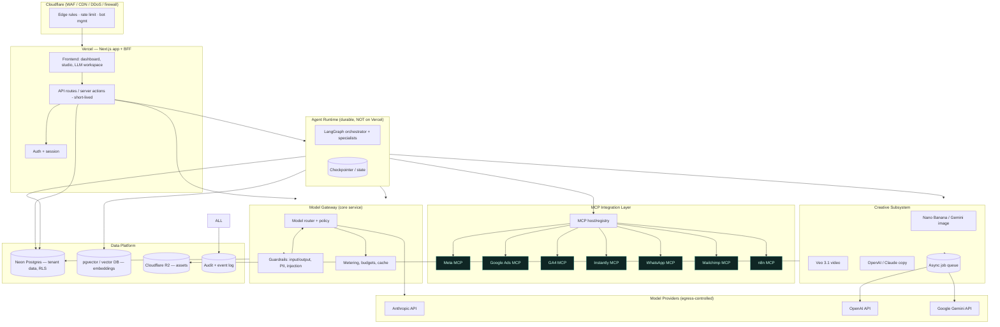
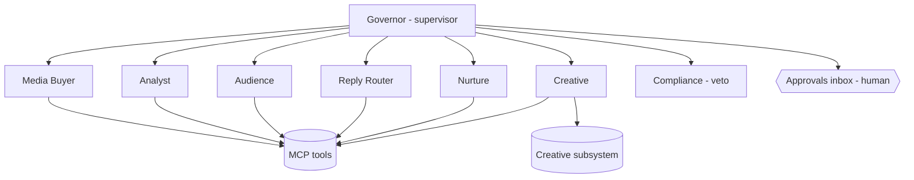

# HELM — Master Architecture & Build Specification

> **Purpose of this document.** This is the authoritative technical specification for building **HELM**, a scalable, multi-tenant, firewalled marketing-operations platform for Universal Learning Aid Pvt Ltd. It is written to be handed directly to **Claude CLI** (Claude Code) as the ground-truth reference for development. Every section is intended to be actionable: architecture, stack, security model, data model, agent design, integration layer, and a phased, task-broken build plan.
>
> **How to use with Claude CLI:** put this file at the repo root as `HELM_ARCHITECTURE.md` (and reference it from `CLAUDE.md`). Point Claude Code at the relevant section per epic. The "Build Plan" (§16) is decomposed into epics and tasks you can feed one at a time.
>
> **Status:** v1 spec · Client 01 = Finnovate (₹999 Financial Health Checkup). Codename "HELM" is a placeholder.

---

## 0. TL;DR — the shape of the system

HELM is a **multi-tenant SaaS control plane** for running performance-marketing campaigns end to end. It does five things:

1. **Connects** every external marketing platform through an **MCP integration layer** (Meta, Google Ads, GA4, Instantly, WhatsApp, Mailchimp, n8n, +more), with per-tenant credentials.
2. **Governs** campaigns with a **LangGraph agent orchestra** — supervised, guardrailed, human-in-the-loop.
3. **Creates** ad content through a **creative subsystem** (OpenAI, Google **Veo 3.1** for video, **Nano Banana** / Gemini image models for graphics).
4. **Reasons** on all complex tasks through the **Anthropic API** (Claude), behind a controlled **model gateway**.
5. **Embeds an internal LLM workspace** so team members never leave the platform to use ChatGPT/Claude/Gemini — all model access is proxied, logged, guardrailed, and **firewalled** (keys never touch the client; the platform is the sole egress to model providers).

**Non-negotiables:** hard multi-tenant isolation · all model traffic through the gateway (no direct provider calls from the browser) · every agent action audited · guardrails on both input and output · secrets server-side only.

**Core stack (as specified):** Next.js on **Vercel** (frontend + BFF) · **Neon** (serverless Postgres, primary DB) · **pgvector on Neon → dedicated vector DB at scale** · **Cloudflare R2** (object storage for creative assets) · **Cloudflare** (WAF/CDN/edge firewall) · **LangChain + LangGraph** (agents) · **MCP** (tool/integration + credential layer) · **Anthropic / OpenAI / Google Gemini** model APIs.

> ⚠️ **One critical stack correction up front (§10.3):** long-running, stateful LangGraph agents must **not** run inside Vercel serverless functions (execution-time limits). Vercel hosts the Next.js app and short API/BFF routes; a **separate durable agent runtime** (LangGraph Platform self-hosted, or a containerized worker service) runs the agents. This split is load-bearing for the whole design.

---

## 1. Product vision & scope

### 1.1 What we are building
A platform where the agency operates all clients' campaigns from one place, and where an AI layer does most of the operational work under human supervision. It starts with Finnovate but is **built multi-tenant from commit one** — new clients are onboarded as tenants, not forks.

### 1.2 The "no need to leave the platform" mandate
Team members currently bounce out to ChatGPT, Gemini, etc. HELM absorbs that: an **embedded LLM workspace** (chat + task tools + creative tools) inside the app. Benefits, and why it must be firewalled:
- **Governance:** all prompts/outputs pass through guardrails and are logged (essential for a SEBI-regulated client's content).
- **Security:** provider API keys live only server-side; users authenticate to HELM, never to OpenAI/Anthropic/Google directly.
- **Cost control & routing:** the gateway routes each request to the right model (cheap vs. frontier), enforces budgets, caches, and rate-limits.
- **Context:** the workspace has grounded access to tenant data (campaigns, leads, creatives) via retrieval — something a raw ChatGPT tab cannot do safely.

### 1.3 Explicitly in scope
Multi-tenancy · RBAC · integration nodes via MCP · agent orchestration · creative generation (image + video + copy) · embedded LLM workspace · unified analytics/attribution · approvals & audit · guardrails/firewall · billing hooks.

### 1.4 Out of scope (rails we rent, never rebuild)
Ad auction/serving (Meta/Google) · email deliverability (Instantly/ESP) · WhatsApp routing (BSP) · base foundation models · video render infrastructure (Veo) · the Postgres/object-store engines themselves.

---

## 2. Guiding principles

1. **Multi-tenant by default.** Every table, query, cache key, storage path and log line is tenant-scoped. There is no "global" data path that can leak across tenants.
2. **The gateway is the only door to models.** No component — especially not the browser — calls a model provider directly. Everything goes through the internal **Model Gateway** (§7).
3. **Guardrails on both sides.** Validate/redact **inputs** (prompt-injection, PII, policy) and **outputs** (compliance, PII, hallucination checks) for every LLM call.
4. **Agents propose; humans dispose (above thresholds).** Tiered autonomy + approvals inbox + hard policy engine + kill switch.
5. **Everything is an event, everything is audited.** Immutable log of every human and agent action.
6. **Own the brain, rent the rails.** Custom = orchestration, algorithms, data model, gateway. Bought = provider APIs.
7. **Stateless edge, durable core.** Vercel/edge is stateless; durable state lives in Neon, R2, and the agent runtime's checkpoint store.
8. **Cost is a first-class metric.** Token/spend budgets per tenant, per feature, enforced in code.

---

## 3. High-level architecture



**Read it as:** the browser only ever talks to Vercel. Vercel's BFF talks to the Model Gateway and the Agent Runtime. The Gateway is the sole path to model providers (the "firewall" around AI). Agents reach the outside world only through MCP servers (which hold per-tenant credentials). All durable state is in Neon / vector DB / R2, and everything writes to the audit log.

---

## 4. Multi-tenancy & scalability

### 4.1 Tenancy model
- **Shared database, shared schema, Row-Level Security (RLS).** Every tenant-owned table carries `tenant_id`; Neon/Postgres RLS policies enforce isolation at the database layer so an app bug cannot cross tenants. This scales to many tenants cheaply and is the recommended default.
- **Escalation path:** a large/regulated tenant can be moved to a **dedicated Neon project/branch** (schema-per-tenant or DB-per-tenant) without changing app code — the data-access layer resolves the tenant's connection at runtime.
- **Tenant context** is established at auth time and threaded through every layer as a signed, immutable context object (`tenant_id`, `user_id`, `role`, `scopes`). Never inferred from client input.

### 4.2 Scalability posture
- **Stateless app tier** (Vercel) scales horizontally by default.
- **Neon** provides serverless autoscaling + branching (use branches for per-environment and for heavy tenants). Use **connection pooling** (Neon's pooler / PgBouncer) — serverless functions exhaust connections fast.
- **Agent runtime** scales as a worker pool; long jobs are checkpointed so they survive restarts and scale-outs.
- **Creative generation** is fully async (queue + workers) — video especially (Veo jobs take time).
- **Caching:** gateway-level semantic/response cache; edge cache for static; per-tenant rate limits to protect noisy-neighbor.
- **Data growth:** start with pgvector on Neon; migrate embeddings to a dedicated vector DB (Qdrant/Pinecone/Weaviate) when index size or QPS demands. Analytics rollups can move to a columnar store later.

---

## 5. Security architecture — the firewall & guardrails

Security here is two distinct things the user asked for: (a) a **network/perimeter firewall**, and (b) **AI-layer guardrails**. Both are mandatory.

### 5.1 Perimeter / network firewall
- **Cloudflare in front of everything:** WAF, DDoS protection, bot management, rate limiting, geo/IP rules. This is the outer firewall.
- **Egress control:** only the Model Gateway and MCP servers may make outbound calls to model providers / external APIs. App and agent tiers cannot call providers directly — enforced by network policy + code. This is what "protected behind a firewall" means for AI: a single, monitored egress.
- **Zero-trust internal:** services authenticate to each other (mTLS or signed service tokens). No implicit trust by network location.
- **Secrets:** all provider keys, OAuth tokens and tenant credentials live in a **secrets manager / vault**, injected server-side, never shipped to the browser, never in the repo. Rotatable and revocable.
- **Private networking:** Neon and internal services reachable over private endpoints where the platform allows; public surface minimized to the Vercel app + gateway ingress.

### 5.2 AI-layer guardrails (input + output)
Applied on **every** LLM/agent call, in the Gateway and around agents:

| Stage | Guardrail | Purpose |
|---|---|---|
| Input | **Prompt-injection detection** | Block "ignore previous instructions" and tool-hijack attempts, especially on content fetched from the web/replies |
| Input | **PII detection & redaction** | Strip/replace investor PII before it hits a provider unless the tenant policy allows it |
| Input | **Policy/allow-list** | Which models, tools, token limits a given role/tenant may use |
| Input | **Injection isolation for tool output** | Treat MCP/tool/web output as untrusted data, never as instructions |
| Output | **Compliance filter (SEBI)** | Block guaranteed-return claims, misleading financial language |
| Output | **PII / secrets leak check** | Ensure responses don't leak other tenants' data or credentials |
| Output | **Grounding / citation check** | For factual/data answers, require retrieval grounding |
| Both | **Content safety** | Standard safety categories |
| Runtime | **Rate & budget limits** | Per tenant/user/feature token + spend caps |
| Runtime | **Immutable audit** | Log prompt hash, model, tokens, cost, decision, verdicts |

Implementation: a reusable **guardrail middleware** wrapping the Gateway; a dedicated **Compliance Agent** for domain rules; a **policy engine** (rules in code/config) that agents cannot override; a **kill switch** that freezes all agent autonomy and model egress instantly.

### 5.3 AuthN / AuthZ
- **AuthN:** email/SSO login to HELM (e.g., Auth.js/Clerk/WorkOS). MFA for admins.
- **AuthZ:** RBAC — roles like `owner`, `agency_admin`, `strategist`, `creative`, `analyst`, `client_viewer` (read-only, tenant-scoped). Scopes gate actions (e.g., only `strategist` approves budget shifts).
- **Client access:** clients get a locked-down, read-only tenant view.

---

## 6. Model strategy & routing

### 6.1 Model split (as specified)
| Workload | Provider / model | Notes |
|---|---|---|
| **Complex reasoning, agents, orchestration, analysis, the internal workspace's "hard" tasks** | **Anthropic API (Claude)** | Default brain for planning, tool-use, long-context, code, analysis |
| **General/creative copy, some workspace chat, embeddings alt** | **OpenAI API** | Copy variants, lightweight chat, whisper/tts if needed |
| **Image generation & editing (graphics, ad creative)** | **Google Gemini — Nano Banana family** | See §11 for exact model IDs |
| **Video generation (ad videos, reels)** | **Google Gemini — Veo 3.1** | Async; see §11 |

### 6.2 The Model Gateway (own this)
A single internal service/module every model call routes through. Responsibilities:
- **Routing:** map a logical task (`reasoning.plan`, `copy.variant`, `image.generate`, `video.generate`, `embed`) to a concrete provider+model, so you can swap models without touching callers.
- **Guardrails:** run §5.2 input/output checks.
- **Metering & budgets:** count tokens/cost per tenant/feature; enforce caps; emit usage events.
- **Caching & retries:** response cache; provider fallback (e.g., if one provider errors, retry/failover per policy).
- **Key custody:** holds provider keys; callers never see them.
- **Observability:** trace every call (latency, tokens, cost, model, verdicts).

> Design the Gateway API around **logical capabilities**, not providers: `gateway.complete(task, messages, policy)`, `gateway.embed(...)`, `gateway.image(...)`, `gateway.video(...)`. This is what lets Anthropic/OpenAI/Gemini be routing choices, not hard dependencies.

---

## 7. The embedded LLM workspace (internal ChatGPT/Claude replacement)

A first-class surface in the app so users never leave for external LLM tools.

**Features**
- **Chat** with model selection (routed via the Gateway; default Claude for reasoning).
- **Grounded context:** opt-in retrieval over tenant data (campaigns, leads, creatives, docs) via the vector DB — answers cite tenant data.
- **Task tools / prompt library:** saved, shareable prompt templates (ad brief, audience analysis, reply drafting, report writing) — reusable across the team.
- **Creative shortcuts:** "generate image / video / copy" jump straight into the creative subsystem (§11).
- **Files:** upload → R2, parsed/embedded for chat.
- **History:** per-user, tenant-scoped, searchable, audited.

**Why it's safe:** every message flows through the Gateway guardrails; no key exposure; full logging; DLP on outputs. This is strictly better than a raw ChatGPT tab for a regulated client.

---

## 8. Agent architecture (LangChain + LangGraph)

### 8.1 Framework roles
- **LangGraph** = the orchestration engine: stateful graphs, supervisor/worker topology, checkpointing, human-in-the-loop interrupts, retries. This is where the durable agent logic lives.
- **LangChain** = building blocks: model/tool bindings, retrievers, output parsers, memory utilities.
- **MCP** = how agents reach external tools & credentials (§9). Agent tools are largely MCP tool calls.

### 8.2 Topology — supervisor + specialists


| Agent | Job | Key tools |
|---|---|---|
| **Governor** (supervisor) | Holds objective (lowest CAC that stays advisory-qualified), plans, delegates, escalates | all agents, approval queue |
| **Media Buyer** | Budget/bid moves, pause losers | Meta/Google MCP + budget-allocation algo |
| **Analyst** | Funnel, attribution, daily readout | GA4 MCP, warehouse, attribution |
| **Audience** | List build/enrich, hashed audiences, suppression | data + Meta/Google audience MCP + lead-scoring |
| **Reply Router** | Classify + draft + route inbound replies | Instantly/WhatsApp MCP + reply-intent classifier |
| **Nurture** | Abandoned checkout, reminders, retargeting | WhatsApp/Mailchimp/Meta MCP + send-time model |
| **Creative** | Brief → generate → tag → ship → learn | creative subsystem + ad MCP + creative-ranking |
| **Compliance** | SEBI/PII/opt-out veto on all outbound | policy engine, suppression |

### 8.3 Governance mechanics
- **Tiered autonomy** per action (auto / propose-and-wait / always-human).
- **Human-in-the-loop:** LangGraph `interrupt` → approvals inbox → resume from checkpoint.
- **Policy engine:** hard caps (spend, banned phrases, hours, suppression) enforced below agents.
- **Checkpointing:** every step persisted (Postgres checkpointer) so runs are durable, resumable, auditable.
- **Kill switch:** global freeze of autonomy + egress.

### 8.4 Custom models / algorithms (your IP)
Budget-allocation optimiser (bandit/rules), lead-scoring (fit model), reply-intent classifier, send-time optimiser, creative-ranking. Start with rules + frontier-API classification; graduate the high-volume narrow ones (reply-intent) to small fine-tuned/self-hosted models only when volume/cost/privacy justify it.

---

## 9. Integration layer via MCP (API-key & tool management)

**MCP is the integration backbone and the credential broker.** Each external platform is wrapped as an **MCP server** exposing normalized tools; agents/the app call tools without ever handling raw keys.

### 9.1 Pattern
- **One MCP server per platform** (Meta Ads, Google Ads, GA4, Instantly, WhatsApp/BSP, Mailchimp, n8n, +future). Each implements the connector contract: `auth`, `actions`, `read`, `webhooks`, `normalize`.
- **Per-tenant credentials:** MCP servers resolve the calling tenant's stored OAuth token / API key from the vault. **Authorization uses OAuth 2.1** per the current MCP spec; API-key-based tools store keys in the vault, scoped per tenant, never exposed to the model or the browser.
- **Registry:** a tenant-scoped registry of connected integrations + health + scopes (drives the "Integrations" UI).
- **Normalization:** everything maps to canonical entities (`Channel, Campaign, Creative, Audience, Contact, Touch, Reply, Conversion`) so agents are platform-agnostic.
- **Untrusted output:** tool results are data, never instructions — passed through injection guards before reaching an LLM.

### 9.2 Why MCP (vs. bespoke SDK calls)
Uniform tool interface for agents, clean credential isolation, hot-add of new tools, and reuse of the growing MCP ecosystem. Adding a marketing tool later = stand up its MCP server + register it; no core changes.

---

## 10. Creative subsystem

Async, queue-driven. The Creative Agent and the workspace both call it.

### 10.1 Models (verified IDs — see §17 for the full table)
- **Graphics / image (Nano Banana family, Gemini):**
  - `gemini-3.1-flash-image` — **Nano Banana 2**, generalist workhorse (generate + edit + multi-image + up to 4K).
  - `gemini-3.1-flash-lite-image` — **Nano Banana 2 Lite**, fastest/cheapest, text-to-image, 1K.
  - `gemini-3-pro-image` — **Nano Banana Pro**, premium/complex, reasoning, up to 4K, style refs.
  - `gemini-2.5-flash-image` — **original Nano Banana** (legacy; migrate to 2 Lite).
- **Video (Veo, Gemini):** `veo-3.1-generate-preview` — **Veo 3.1** — text-to-video + image-to-video, native audio, up to 3 reference images, scene extension, first/last-frame transitions. (Veo 3.1 priced same as Veo 3; per-second billing — confirm current rate on the Gemini pricing page.)
- **Copy:** OpenAI and/or Claude via the Gateway, on a Finnovate brand + compliance prompt.

### 10.2 Pipeline
```
Brief (audience+hook+offer)
  → Copy (Gateway → OpenAI/Claude)
  → Image (Gemini Nano Banana) / Video (Veo 3.1)  [async jobs]
  → Compliance gate (SEBI + brand)
  → Store asset in R2 (tenant-scoped path) + metadata in Neon
  → Ship to ad MCP (tagged)
  → Measure (CAC/checkup by variant) → feed creative-ranking → next brief
```
- **Jobs:** Veo/image generation are long/async → job queue + webhook/poll → status surfaced in the studio. Never block a request thread on generation.
- **Assets:** R2 with tenant-scoped keys (`{tenant_id}/creatives/{asset_id}`), signed URLs for access; metadata, tags, and performance in Neon.
- **Brand locking:** templates carry logo, palette, and the mandatory SEBI disclaimer so every asset is compliant by construction.

### 10.3 ⚠️ Vercel + long-running work
Vercel serverless functions have execution-time limits and are the wrong place for: LangGraph agent runs, Veo/image generation waits, batch syncs. **Run these on a durable runtime:** LangGraph Platform (self-hosted or managed) for agents, and a containerized worker service (e.g., Fly.io / Railway / Render / a small K8s / AWS ECS) with a queue for creative and sync jobs. Vercel keeps the Next.js UI + BFF + webhooks (which enqueue, not execute).

---

## 11. Data architecture

### 11.1 Stores
| Store | Tech | Holds |
|---|---|---|
| Primary DB | **Neon Postgres** (RLS, pooled) | tenants, users, integrations, campaigns, creatives, contacts/leads, events, conversions, agent runs/checkpoints, approvals, audit |
| Vector | **pgvector on Neon** → dedicated vector DB at scale | embeddings for workspace retrieval, reply/creative memory, docs |
| Objects | **Cloudflare R2** | creative assets, uploads, exports — tenant-scoped keys, signed URLs |
| Audit/events | Neon (append-only) → optional stream/columnar later | immutable action + usage log |

### 11.2 Canonical model (sketch — RLS `tenant_id` on all)
```
tenants(id, name, plan, status, created_at)
users(id, tenant_id, email, role, status)
integrations(id, tenant_id, kind, status, scopes, credential_ref, health, last_sync_at)
campaigns(id, tenant_id, channel, external_id, name, status, objective, budget, created_by)
ad_groups(id, tenant_id, campaign_id, external_id, name, status)
creatives(id, tenant_id, campaign_id, kind[image|video|copy], asset_key, tags[], status, perf jsonb)
contacts(id, tenant_id, email_hash, phone_hash, segment, fit_score, consent, suppression, identity jsonb)
touches(id, tenant_id, contact_id, channel, type, ts, meta jsonb)          -- append-only event stream
conversions(id, tenant_id, contact_id, kind[checkup|advisory], value, ts, attribution jsonb)
agent_runs(id, tenant_id, graph, status, objective, created_at)
agent_steps(id, tenant_id, run_id, agent, action, input jsonb, output jsonb, verdict, ts)  -- audit
approvals(id, tenant_id, run_id, action, proposed_by, payload jsonb, status, decided_by, decided_at)
usage_events(id, tenant_id, feature, model, tokens_in, tokens_out, cost, ts)  -- metering
audit_log(id, tenant_id, actor_type, actor_id, action, target, meta jsonb, ts)  -- immutable
```
PII (email/phone) stored **hashed**; raw contact fields encrypted at rest and access-logged. Consent/suppression are first-class (DPDP + campaign requirement).

---

## 12. Full tech stack & required services

| Layer | Choice | Why |
|---|---|---|
| Frontend | **Next.js (App Router) + React + TypeScript**, Tailwind, shadcn/ui | one framework for dashboard + studio + workspace |
| Hosting (app) | **Vercel** | Next.js-native, edge, previews; BFF + webhooks only (no long jobs) |
| Perimeter | **Cloudflare** (WAF/CDN/DDoS/rate limit) + **R2** | firewall + object storage |
| Primary DB | **Neon Postgres** + pooling + RLS | serverless, branching, scales; RLS = tenant isolation |
| Vector | **pgvector (Neon)** → Qdrant/Pinecone/Weaviate at scale | start simple, migrate on demand |
| Agent runtime | **LangGraph** (LangGraph Platform self-host **or** container worker) | durable, stateful, HITL — **not on Vercel** |
| Agent libs | **LangChain + LangGraph** (TS or Python) | orchestration + building blocks |
| Integrations | **MCP servers** (one per platform) | uniform tools + per-tenant credential broking (OAuth 2.1) |
| Model gateway | custom service/module | routing, guardrails, metering, key custody |
| Models — reasoning | **Anthropic API (Claude)** | agents, analysis, workspace hard tasks |
| Models — copy/aux | **OpenAI API** | copy, light chat, tts/stt |
| Models — image | **Gemini Nano Banana family** | graphics/ad creative |
| Models — video | **Gemini Veo 3.1** | ad videos/reels (async) |
| Queue/jobs | Redis/queue (e.g., Upstash) or the platform's native queue | async creative + syncs |
| Secrets | vault / secrets manager | provider keys + per-tenant tokens |
| Auth | Auth.js / Clerk / WorkOS | login, MFA, SSO |
| Observability | tracing + logs + LLM tracing (e.g., LangSmith) | latency/cost/quality + audit |

**Language decision to make (§18):** TypeScript-only (LangGraph.js everywhere, one language) **vs.** TS frontend + Python agent service (richer ML ecosystem). Recommendation: **TS-first** for a small team and one-language velocity; add a Python service only when custom-ML (lead-scoring/fine-tunes) demands it.

---

## 13. Environments, config & secrets

- **Environments:** `local` → `preview` (Vercel per-PR + Neon branch) → `staging` → `production`. Neon branching gives cheap isolated DBs per environment.
- **Secrets (server-side only; never in browser/repo):**
  ```
  # models (gateway only)
  ANTHROPIC_API_KEY=
  OPENAI_API_KEY=
  GOOGLE_GEMINI_API_KEY=        # Nano Banana + Veo
  # data
  NEON_DATABASE_URL=            # pooled
  NEON_DATABASE_URL_UNPOOLED=   # migrations
  VECTOR_DB_URL=                # if dedicated
  # storage
  R2_ACCOUNT_ID= R2_ACCESS_KEY_ID= R2_SECRET_ACCESS_KEY= R2_BUCKET=
  # auth + security
  AUTH_SECRET= AUTH_PROVIDER_KEYS=
  ENCRYPTION_KEY=               # for tenant credential encryption
  # agent runtime
  LANGGRAPH_API_URL= LANGSMITH_API_KEY=
  # integrations (per-tenant OAuth/keys live in the VAULT, not here)
  VAULT_ADDR= VAULT_TOKEN=
  ```
- **Per-tenant integration credentials** are stored encrypted in the vault, referenced by `integrations.credential_ref` — **not** in env files.

---

## 14. Observability, cost & rate control

- **Tracing:** distributed traces across BFF → Gateway → Agent → MCP; LLM-specific tracing (LangSmith or equivalent) for prompt/response/token/cost.
- **Metering:** `usage_events` per tenant/feature/model → dashboards + budget enforcement + client billing hooks.
- **Rate limits:** per tenant/user/feature at the Gateway and Cloudflare edge.
- **Alerts:** cost spikes, guardrail-block rates, agent error rates, integration health, kill-switch events.

---

## 15. Compliance

- **DPDP Act (India):** consent, purpose limitation, opt-out, deletion for investor PII; hashing + encryption + access logs; data-residency awareness.
- **SEBI-safe messaging:** Compliance Agent + policy engine block guaranteed-return/misleading claims on every outbound ad and message.
- **Channel policy:** WhatsApp template approval, cold-email opt-out, Meta/Google ad policy — encoded as rules the MCP layer enforces before send.
- **Auditability:** immutable log is the evidence trail for any automated financial-adjacent action.

---

## 16. Build plan — epics & tasks (Claude-CLI-ready)

Each epic is a coherent unit of work; tasks are sized for a CLI session. Two tracks run in parallel (campaign on existing tools + platform build) — see the companion Roadmap. Ordering assumes a small team.

### EPIC 1 — Foundations & tenancy
- [ ] Monorepo scaffold (Next.js app, `packages/` for gateway, agents, mcp, db, shared types).
- [ ] Neon project + Drizzle/Prisma schema for §11 tables; **RLS policies** + tenant-context helper.
- [ ] Auth (login, MFA, RBAC roles/scopes); signed tenant-context object.
- [ ] Audit-log module (append-only) wired as middleware.
- [ ] CI/CD (Vercel + Neon branch previews), env/secrets wiring, vault integration.

### EPIC 2 — Model Gateway + guardrails
- [ ] Gateway service with logical-capability API (`complete/embed/image/video`).
- [ ] Provider adapters: Anthropic, OpenAI, Gemini (image+video). Routing table.
- [ ] Guardrail middleware: input (injection, PII, policy) + output (compliance, PII, safety).
- [ ] Metering (`usage_events`) + per-tenant budgets + rate limits + response cache.
- [ ] Kill switch + egress-control checks.

### EPIC 3 — Embedded LLM workspace
- [ ] Chat UI with model selection (via Gateway); tenant-scoped history.
- [ ] Retrieval over tenant data (pgvector) with citations.
- [ ] Prompt/template library (shared, versioned).
- [ ] File upload → R2 → parse/embed.

### EPIC 4 — MCP integration layer
- [ ] MCP host/registry + tenant-scoped integrations UI (connect/health/scopes).
- [ ] Credential vault + OAuth 2.1 flows; per-tenant token resolution.
- [ ] MCP servers (read-first): **Meta, Google Ads, GA4**; normalization to canonical entities.
- [ ] MCP servers: **Instantly, WhatsApp/BSP, Mailchimp, n8n**.
- [ ] Webhook ingestion (replies, form-fills, conversions) → event stream.

### EPIC 5 — Data & analytics
- [ ] Event ingestion + identity resolution (hashed email/phone).
- [ ] Attribution (last-touch → position-based) + funnel rollups.
- [ ] Unified dashboard: funnel, CAC/checkup, channel table, campaign table.
- [ ] Read-only client view.

### EPIC 6 — Agent runtime (LangGraph)
- [ ] Durable runtime (LangGraph Platform self-host or worker) + Postgres checkpointer.
- [ ] Supervisor graph (Governor) + specialist nodes; MCP tools bound.
- [ ] HITL interrupts → **approvals inbox** UI → resume.
- [ ] Policy engine (spend caps, banned phrases, hours, suppression).
- [ ] Agents in order: Analyst, Reply Router, Nurture → Media Buyer, Audience, Creative, Compliance.

### EPIC 7 — Creative subsystem
- [ ] Async job queue + workers (off Vercel).
- [ ] Image via Nano Banana (generate + edit + brand templates); Video via Veo 3.1 (async, poll/webhook).
- [ ] Copy via Gateway; compliance gate; R2 storage + metadata + tags.
- [ ] Studio UI: brief → variants → review → ship; performance feedback loop.

### EPIC 8 — Custom algorithms (IP)
- [ ] Budget-allocation optimiser (rules → bandit).
- [ ] Lead-scoring (rules → learned).
- [ ] Reply-intent classifier (API → fine-tuned small at volume).
- [ ] Send-time + creative-ranking (post-data).

### EPIC 9 — Hardening & scale
- [ ] Multi-tenant load tests; connection-pool tuning; noisy-neighbor limits.
- [ ] Observability dashboards + alerts; cost controls verified.
- [ ] Security review (egress, RLS, secrets, guardrail bypass tests, prompt-injection red-team).
- [ ] Second-tenant onboarding dry run.

---

## 17. Reference — verified model IDs & API notes (as of Jul 2026)

| Capability | Provider | Model ID | Notes |
|---|---|---|---|
| Reasoning/agents | Anthropic | (current Claude model) | via Gateway; long-context, tool-use |
| Copy / light chat | OpenAI | (current GPT model) | via Gateway |
| Image — workhorse | Google Gemini | `gemini-3.1-flash-image` | **Nano Banana 2**; generate+edit+multi-image; to 4K |
| Image — cheap/fast | Google Gemini | `gemini-3.1-flash-lite-image` | **Nano Banana 2 Lite**; text-to-image; 1K |
| Image — premium | Google Gemini | `gemini-3-pro-image` | **Nano Banana Pro**; reasoning, style refs; to 4K |
| Image — legacy | Google Gemini | `gemini-2.5-flash-image` | original **Nano Banana**; migrate off |
| Video | Google Gemini | `veo-3.1-generate-preview` | **Veo 3.1**; t2v+i2v, native audio, refs, scene-extend; async; per-second billing |

> Model IDs move fast. The **Gateway routing table is the single place** these are configured — callers use logical tasks, so upgrading a model is a one-line change. Confirm exact IDs/pricing on the provider docs at build time (Gemini API image + video docs; Anthropic + OpenAI model lists).

---

## 18. Open decisions (resolve before/early in the build)

1. **Language for agents:** TS-only vs. TS+Python service. *Recommendation: TS-first; add Python only for custom ML.*
2. **Agent hosting:** LangGraph Platform (managed) vs. self-hosted vs. plain container worker. *Recommendation: self-host/managed LangGraph for durability + HITL; revisit if overkill.*
3. **Vector DB timing:** pgvector now; when to move to a dedicated vector DB (index size/QPS threshold).
4. **Auth vendor:** Auth.js vs. Clerk vs. WorkOS (SSO for enterprise clients).
5. **Queue:** Upstash/Redis vs. platform-native.
6. **Billing:** how tenant usage (`usage_events`) maps to client invoices / the retainer.
7. **Data residency:** any client requiring India-only data hosting → pick Neon/R2 regions accordingly.

---

## 19. Companion documents
- **Architecture Blueprint** (conceptual, 7-layer, agent design) — `helm-blueprint`.
- **Build Roadmap** (Phase 0 pilot → V2, two-track plan) — `helm-roadmap`.
- **Prototype** (clickable dashboard, mock data) — `helm-prototype`.
- **This file** — the technical build spec for Claude CLI.

---

*Sources for volatile facts (model IDs, MCP auth, agent hosting) verified Jul 2026: Google Gemini API image-generation & Veo docs, Google Developers Blog (Veo 3.1), Model Context Protocol spec + OAuth 2.1 guidance, LangGraph Platform GA docs. Confirm exact model IDs and pricing at build time — they change frequently; the Gateway is designed so that costs nothing but a config edit.*
