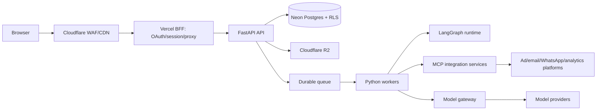

# HELM Backend Architecture (Stage 0)

## Status and authority

This is the Stage 0 target architecture for the production backend. It refines [HELM_ARCHITECTURE.md](../HELM_ARCHITECTURE.md), whose security, multi-tenancy, gateway-only model access, auditability, and durable-agent principles remain authoritative. The Python/FastAPI platform is the system of record. The future Vercel BFF is a browser/session edge only; it does not own business authorization or data.

## Runtime topology

Cloudflare protects public ingress. The BFF may call only a versioned FastAPI API through an authenticated service channel. FastAPI, workers, MCP services, and the model gateway run in private networking where possible. Only the gateway and named integration egress services may reach providers or channel APIs.

## Components and responsibilities

| Component | Responsibility | Must not do |
|---|---|---|
| FastAPI API | Canonical domain API; authorization; tenant context; audit; approval decisions; signed R2 access; command admission | Long-running generation, agent execution, provider calls from request handlers |
| Worker runtime | Executes queued jobs, synchronization, webhooks after verification, creative workflows, and retries | Trust browser/BFF claims without a signed job context |
| LangGraph runtime | Durable/checkpointed agent graphs and approval interrupts | Bypass policy, approval, gateway, MCP, or audit services |
| Model gateway | Logical task routing, guardrails, model key custody, budget/rate enforcement, metering | Accept arbitrary provider/model selection or browser calls |
| MCP/integration service | Credential resolution from vault; normalized tools; webhook verification; channel policy enforcement | Return raw credentials or treat external content as instructions |
| Neon | Canonical relational data, RLS-enforced tenant isolation, audit ledger, checkpoints/metadata | Store large objects, raw provider secrets, or queue payloads as a substitute for a queue |
| R2 | Cloudflare R2 creative assets/uploads/exports using tenant-prefixed keys, an APAC location hint, and short-lived signed access | Authorize a caller itself or guarantee Singapore residency |

## Data and execution flows

1. BFF validates a browser session and forwards a short-lived OIDC access token plus a BFF service assertion to FastAPI.
2. FastAPI independently verifies both tokens, obtains the authenticated subject, resolves the requested active tenant against `tenant_memberships`, computes scopes, sets transaction-local Postgres tenant context, and records relevant audit events.
3. Reads return tenant-scoped data. Commands validate scope and policy, write a durable command/job record and audit event in the same database transaction, then enqueue after commit (outbox pattern).
4. Workers acquire the job idempotently, rebuild the signed execution context server-side, and call only the gateway/MCP services. They write step events, usage, state, and an audit event.
5. Actions over an autonomy threshold create an approval record and pause the graph. A FastAPI approval decision resumes the checkpoint through a durable command, never through a frontend callback.

## Production design decisions

- **Identity and membership:** use global `users` plus `tenant_memberships`, not `users.tenant_id`. A user may belong to multiple clients and may hold a different role/scopes per membership. Agency access must be explicit membership, never a wildcard bypass.
- **Tenant isolation:** every tenant-owned table has `tenant_id`, RLS is enabled and forced, and each API/worker transaction sets `app.tenant_id` from server-resolved membership. Repositories receive a scoped transaction, not a raw pool.
- **Tenant provisioning:** forced RLS prevents normal tenant-scoped sessions from creating tenants. A separate privileged, tightly controlled, audited provisioning path is required later; it is not an application-wide bypass.
- **Authorization:** role-to-scope defaults are centrally defined; effective scopes can only narrow role defaults unless an explicit, audited grant policy is approved.
- **Async reliability:** commands use idempotency keys, an outbox, retry classification, dead-letter handling, and per-tenant concurrency/rate budgets. Webhooks use inbox/deduplication storage.
- **Audit:** append-only ledger records actor, effective tenant/membership, request/correlation id, authorization decision, before/after-safe metadata, and outcome. It is not merely application logging.
- **Storage:** HELM uses Cloudflare R2 with an APAC location hint. This is not a guarantee of Singapore-specific residency; the compliance/data-residency limitation remains to be confirmed. R2 object keys include opaque tenant and asset ids. FastAPI authorizes every issuance of a short-lived signed URL; direct bucket listing is disabled.

## Service boundaries and deployment

Start with separately deployable FastAPI API and worker services sharing a Python domain package, a queue, Neon, and R2. The model gateway starts as a clean internal FastAPI Python module/package, callable only by trusted FastAPI API and worker code and never by browsers. It exposes logical gateway capabilities (for example, completion, embedding, image, and video), so API/worker callers never invoke provider SDKs directly.

The gateway retains an explicit interface plus separate configuration, authentication, and egress boundaries from day one. This makes it extractable later as a private standalone service without changing callers. LangGraph runs in worker infrastructure, never Vercel or request-scoped FastAPI processes.

Use distinct development, preview, staging, and production environments with separate OIDC clients/audiences, databases/branches, queues, R2 prefixes/buckets, credentials, and encryption keys. Production migrations run from a privileged, controlled job; application and worker roles cannot bypass RLS or alter schema.

## Existing-project implications

The current `helm-app/db/migrations` and `lib/server` code are useful prototypes, but must not be treated as production backend implementation. The existing direct `users.tenant_id`, UI-only `master/agency/viewer` roles, simple regex guardrails, environment-selected model routes, and frontend mock data conflict with this target and require planned replacement in Stage 1 onward.
